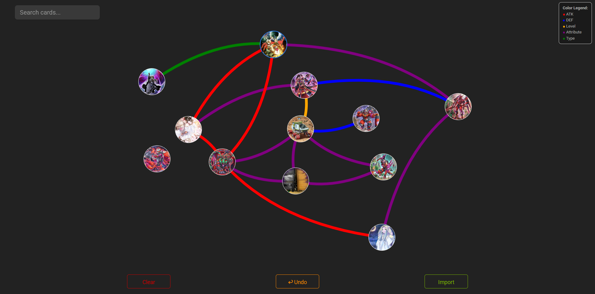

# Yu-Gi-Oh! Small World Bridge Finder

A web tool for analyzing Yu-Gi-Oh! decks and finding card bridges using the *Small World* mechanic. Just copy a `.ydk` deck list to your clipboard and click one button

---

##  Features

-  **.YDK Import:** Paste your deck from the clipboard in a single click — no file uploads or drag-and-drop needed.
-  **Automatic Monster Filtering:** Filters out Extra Deck monsters and spells/traps, so only Main Deck monsters are analyzed.
-  **Connection Analysis:** Finds shared attributes, types, stats, and more to visualize possible *Small World* bridges.
- **Interactive Graph Network:** Uses `vis-network` to let you explore and understand your deck’s inner workings.
- **Instant Search:** Autocomplete with filtering logic for fast, flexible deck exploration.

---

## How to Use

1. Copy your `.ydk` deck list (from MasterDuelMeta, YGOPro, DuelingBook, etc.).
2. Click the **Import Deck** button.
3. Watch the tool auto-load your Main Deck monsters.
4. Explore bridges using shared properties.

or

Simply use the search bar in the top left to add cards to the network

No configuration needed. No files required.

---

##  Tech Stack

- **HTML + Vanilla JS**
- `navigator.clipboard` API for fast and secure clipboard reads
- `vis-network` for graph-based data visualization
- `Awesomplete` for snappy in-page autocomplete

---
